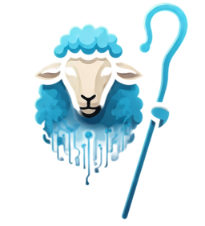
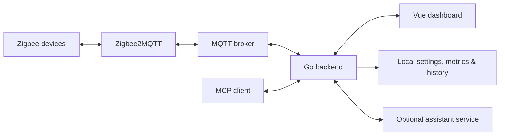

<p align="center">
  
</p>

<h1 align="center">NodeHerder</h1>

<p align="center">A self-hosted dashboard for smart-home devices, automations, and sensor history.</p>

<p align="center">
  <a href="https://github.com/mikeathan/nodeherder/actions/workflows/ci.yml"></a>
</p>

<p align="center">
  <a href="#getting-started">Get started</a> ·
  <a href="docs/setup.md">Setup guide</a> ·
  <a href="docs/integrations.md">API &amp; MCP</a> ·
  <a href="docs/sdd/README.md">Contributing</a>
</p>

NodeHerder connects a Go backend and Vue/TypeScript frontend to MQTT and Zigbee2MQTT.
Manage devices from the browser, build automations, and explore recorded measurements.
An optional assistant integration and MCP server expose household context and metrics
to compatible clients.

## What you can do

- View device state, availability, exposes, and controls in grouped dashboards.
- Create device-triggered and scheduled automations with conditions and actions.
- Chart sensor history and configure metrics retention and per-device debounce.
- Inspect hub logs and manage bridge joining and device settings.
- Query metrics through HTTP or MCP; connect an external assistant service with conversation history.

Metrics recording and MCP are disabled in the default configuration; enable them in
settings. Assistant chat needs an external service URL.

## How it fits together



The backend handles device updates, automations, persistence, and HTTP/WebSocket/MCP
interfaces. The browser receives live updates over WebSocket. Assistant inference
runs in the configured external service.

## Getting started

### Explore the UI without hardware

Use Node from [`.nvmrc`](.nvmrc). Create `frontend/.env.development.local`:

```dotenv
VITE_API_BASE_URL=http://localhost:4110/api
VITE_WS_BASE_URL=ws://localhost:4110/ws
```

Start the fixture-backed mock server:

```bash
cd frontend
npm ci
npm run test-server
```

In another terminal, run `npm run dev` from `frontend/` and open
[localhost:4100](http://localhost:4100). The mock includes a simulated sign-in flow;
it is development tooling with partial API coverage, not a real-device backend.

### Connect your home

Follow the [setup guide](docs/setup.md) for a Linux Docker host with a Zigbee
coordinator, Mosquitto, and Zigbee2MQTT. It covers environment files, authentication,
persistent data, local backend development, and frontend deployment.

Once configured, use the [stack manager](docs/setup.md#stack-manager):

```bash
./scripts/manage-stack.sh rebuild all --dry-run  # Preview without Docker changes
./scripts/manage-stack.sh rebuild all            # Build, then apply
./scripts/manage-stack.sh status
./scripts/manage-stack.sh logs backend --tail 50
```

The Compose stack publishes backend, MQTT, and Zigbee2MQTT ports. Context/MCP routes
are currently public, and a local offline sign-in route exists. Keep deployment behind
trusted-network access controls; see [deployment details](docs/setup.md#deployment-and-access).

## Development

Use Go from [`backend/go.mod`](backend/go.mod) and Node from [`.nvmrc`](.nvmrc).

```bash
# From backend/
go test ./...
go build ./...

# From frontend/ (after npm ci)
npm test -- --runInBand
npm run lint
npm run build
```

CI checks tests, lint, builds, backend races, deployment tooling, and Docker images
on Ubuntu; see [checks and merge requirements](docs/ci.md). The [SDD guide](docs/sdd/README.md) explains specs,
plans, tasks, and review gates. Start behavior changes with a spec; use `$sdd-plan`
for implementation planning. Constitutions are proposed for maintainer adoption.

## Documentation

| Need | Start here |
| --- | --- |
| Installation, configuration, deployment, troubleshooting | [Setup](docs/setup.md) |
| Metrics API, MCP, assistant integration | [Integrations](docs/integrations.md) |
| Code layout and important behavior | [Repository map](docs/sdd/repository-map.md) |
| Device update pipeline | [Architecture](backend/docs/architecture.md) |
| Development policy and templates | [SDD](docs/sdd/README.md) · [Constitution](.specify/memory/constitution.md) |
| Agent instructions and scoped rules | [AGENTS.md](AGENTS.md) |
| Backlog | [TODO.md](TODO.md) |
