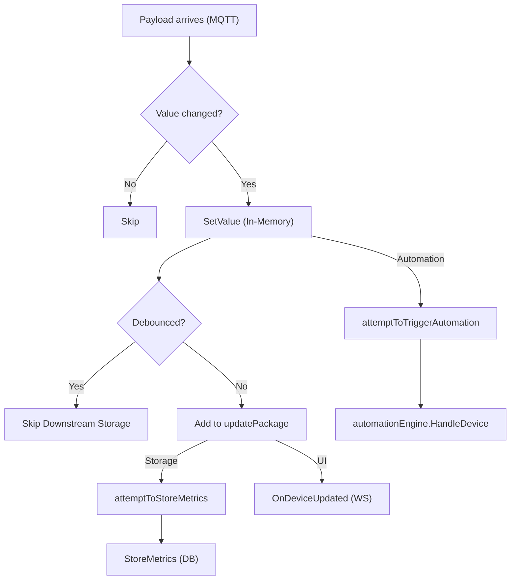

# Backend Architecture: Device Update Flow

This document describes the lifecycle of an incoming device update payload and how it routes through the system.

## Overview

When the backend receives a payload from a device (e.g. via Zigbee2MQTT), it is processed by the `DeviceLifetimeService`. The service has a strict order of operations designed to keep the in-memory state fresh for immediate consumers (like automations) while debouncing the data written to the metrics storage and broadcast to the UI.

### Flow Diagram

## Key Architectural Decisions

### 1. In-Memory State is Always Fresh

The `SetValue()` operation happens **before** any debouncing.

- **Why**: Automations (such as dials adjusting brightness based on a step operation) need to read the absolute latest state of the device. If `SetValue` was debounced, a dial turned quickly would calculate its steps based on stale, debounced data.

### 2. Automation Triggers are Unthrottled

The `attemptToTriggerAutomation()` method fires on **any** real value change (after `ComparePayloadValues`), completely bypassing the debouncer.

- **Why**: User inputs like physical buttons or dials generate rapid, intentional bursts of events. Throttling these would result in missed button presses or sluggish dial responsiveness.

### 3. Storage and UI are Debounced

The `attemptToStoreMetrics()` method and the WebSocket broadcast (`OnDeviceUpdated`) only receive data that makes it past the `debouncerService.DebounceExpose()` check.

- **Why**: Noisy sensors (like `linkquality` bouncing between 80 and 81 every second) would flood the database and overwhelm the frontend UI if every single change was recorded. The debouncer ensures we capture representative samples of environmental data while ignoring high-frequency jitter.

### Separation of Concerns

By splitting the pipeline early, we fulfill conflicting requirements without coupling:

- **Immediate action** (automations) gets raw, real-time data.
- **Historical tracking and observation** (metrics, UI) gets filtered, clean data.
