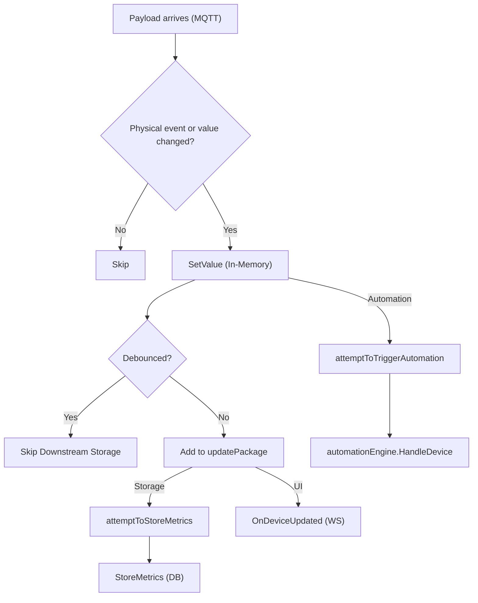

# Backend Architecture: Device Update Flow

This document describes the lifecycle of an incoming device update payload and how it routes through the system.

## Overview

When the backend receives a payload from a device (e.g. via Zigbee2MQTT), it is processed by the `DeviceLifetimeService`. The service has a strict order of operations designed to keep the in-memory state fresh for immediate consumers (like automations) while debouncing the data written to the metrics storage and broadcast to the UI.

### Ordering (spec 005)

Messages are handled one at a time per device, in arrival order, end to end:
paho delivers in order (`SetOrderMatters(true)`) and its callback only queues the
message on the hub's single **ingress lane** (`HubController.Ingest`, also used by the
HTTP data collector). The ingress lane owns the topic→handler map and hands each message
to a **device lane** keyed by topic (all `bridge/*` topics share one lane), which runs
the whole update (dedupe, automations, store, broadcast) before the next message for
that device. Different devices run concurrently. Lanes (`internal/lanes`) hold a goroutine
only while busy, queue at most 1,000 messages per device (beyond that: rejected, logged,
counted) and drain on hub context cancellation. Manual triggers run on the automation's
device lane; if it does not start before the request deadline the API returns 503.
Each automation run gets its own context (exposes + origin) over persistent state.

### Flow Diagram

```mermaid
flowchart TD
    A["Payload arrives (MQTT)"] --> B{"Physical event or value changed?"}
    B -->|No| SKIP["Skip"]
    B -->|Yes| C["SetValue (In-Memory)"]
    C --> D{"Debounced?"}
    D -->|Yes| E["Skip Downstream Storage"]
    D -->|No| F["Add to updatePackage"]

    %% Automation always triggers on real changes regardless of debounce
    C -->|Automation| G["attemptToTriggerAutomation"]
    G --> H["automationEngine.HandleDevice"]

    %% Storage and UI use the debounced updatePackage
    F -->|Storage| I["attemptToStoreMetrics"]
    I --> J["StoreMetrics (DB)"]

    F -->|UI| K["OnDeviceUpdated (WS)"]
```

## Key Architectural Decisions

### 1. In-Memory State is Always Fresh

The `SetValue()` operation happens **before** any debouncing.

- **Why**: Automations (such as dials adjusting brightness based on a step operation) need to read the absolute latest state of the device. If `SetValue` was debounced, a dial turned quickly would calculate its steps based on stale, debounced data.

### 2. Automation Triggers are Unthrottled

The `attemptToTriggerAutomation()` method receives accepted changes and repeated
physical events, independently of UI/metrics debounce, when automation is enabled.
Unchanged state is deduplicated; whitelisted event values bypass equality checks.

- **Why**: User inputs like physical buttons or dials generate rapid, intentional bursts of events. Throttling these would result in missed button presses or sluggish dial responsiveness.

### 3. Storage and UI are Debounced

The `attemptToStoreMetrics()` method and the WebSocket broadcast (`OnDeviceUpdated`) only receive data that makes it past the `debouncerService.DebounceExpose()` check.

- **Why**: Noisy sensors (like `linkquality` bouncing between 80 and 81 every second) would flood the database and overwhelm the frontend UI if every single change was recorded. The debouncer ensures we capture representative samples of environmental data while ignoring high-frequency jitter.

### Separation of Concerns

By splitting the pipeline early, we fulfill conflicting requirements without coupling:

- **Immediate action** (automations) gets raw, real-time data.
- **Historical tracking and observation** (metrics, UI) gets filtered, clean data.

## Automation reload and failures

The engine's runtime registry contains only configured generations. Storage holds
persisted recipes; loading a recipe does not make it executable. Reads, enabled
checks and triggers keep using the last working generation while replacements are
prepared. Load/configuration/handler/save failures retain it and are logged/returned.
First-load failures remain unavailable. A failed disk scan never implies deletion.

Schedules prepare owned replacements and roll back on failure. Matching time/type
sets preserve the current enabled window (including reordered lists), but callbacks
bind the replacement object. Removed/replaced schedules cancel timers and context
watchers; already committed callbacks may finish against their old generation.
Already accepted actions, including delayed commands, may finish after replacement
or deletion. Reload does not join commands, retry them, or confirm physical state.

Management writes are single-owner: overlapping/re-entrant save/delete requests
return an update-in-progress error; callers may retry after completion. Triggers and
reads do not wait for preparation. Immediate execution errors reach manual callers;
physical/asynchronous failures are logged. Later actions still run if one fails.
An existing trigger whose conditions do not match remains a successful no-op.

Recipe saves sync a staged file, then replace atomically in the same directory,
preserving existing permission bits and valid symlink targets. The configuration
directory must be writable (Compose mounts the directory). This is not a multi-file
transaction or a guarantee against power-loss/directory-metadata corruption.

Observed explicit Z2M source disable overrides failure fallback: remove executable
access before retiring schedules. Cleanup failure is reported and retried on reload,
never restores execution. Persisted recipes remain for successful later re-enable;
already accepted commands remain non-joining. Ordinary configuration/save failures
retain working generations. Disable is observed through existing configure/reload
paths, not new polling. See [FR-20](../../specs/003-backend-race-repair/plan.md).
